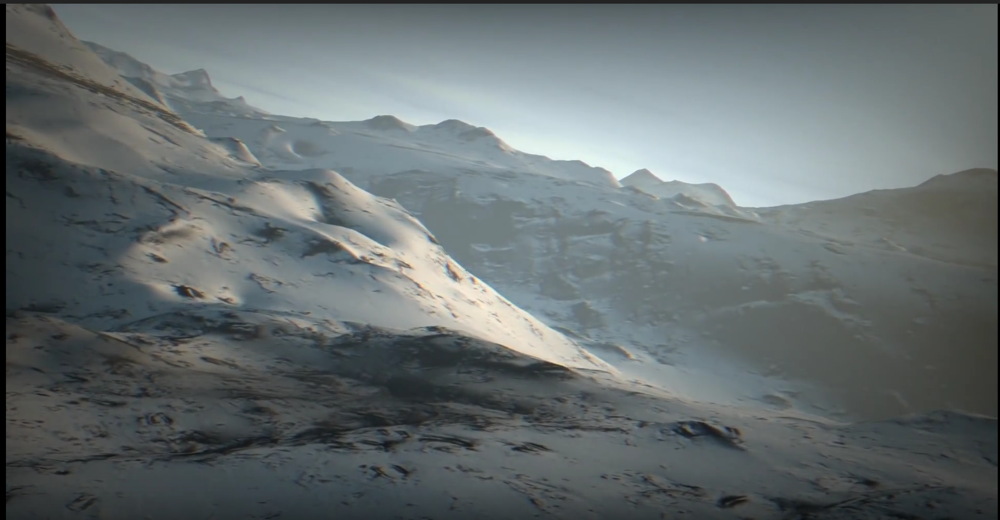

 

[link](https://www.youtube.com/watch?v=jB0vBmiTr6o)

I chose the "elevated" demo, a program which flies you through a procedurally
generated world with lighting and texturing and shadows. The effects aren't
that impressive, but what is impressive is it's 4KB. A lot of work was put
into minimizing the binary size, meaning the code had to be extremely
optimized for space, as well as having the realtime requirement, so speed, as
well as aesthetic. The terrain is all generated using vertex displacement and
a noise function for randomness. Erosion of the terrain is added, lighting
using raymarching, fake shadows by comparing real normal and smooth normal.
Theres motion blur, dust, grain. Authentic camera movement. All in 4KB.
