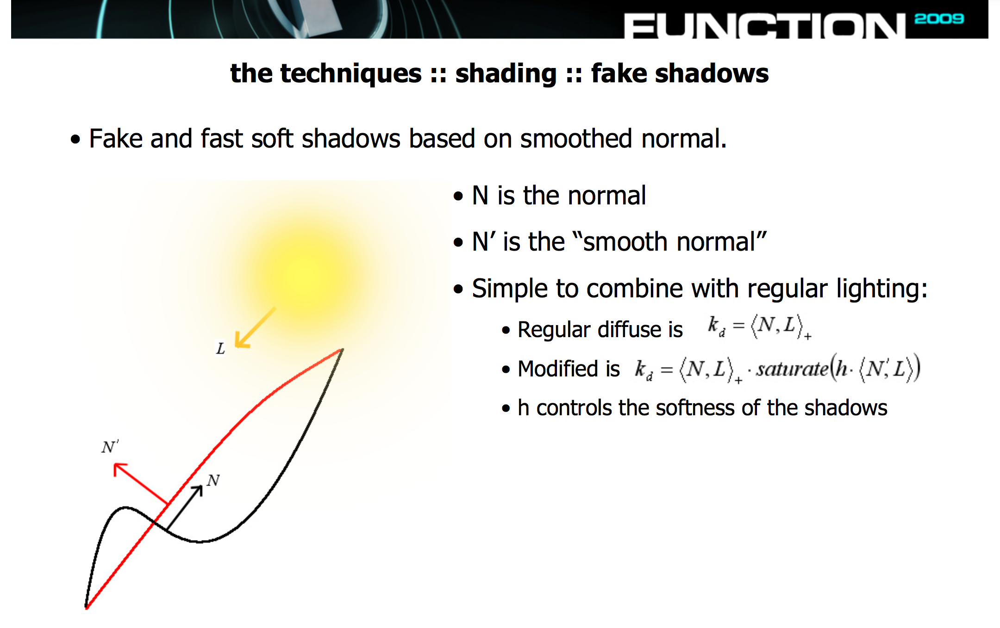

__Part 1__ _Deferred shading_. This is a two pass shading scheme. In the first pass, the geometry is rendered in a number of off screen buffers. One buffer contains, say, Kd, one contains normals, one contains depth, one position, etc. The buffers should contain everything needed for lighting calculation. Then, second pass uses the first pass buffers as input, for each fragment in the output image it reads in the value from each of the buffers and uses it to calculate lighting. This can be faster, especially with more lights, because lighting is only calculated once per pixel rather than per fragment of geometry - geometry which may not even be visible.

This is what the buffers would look like:

Another concept that I'm thinking of doing for the final project is using a noise function for displacement mapping to create a terrain, and implementing _self shadowing_ using the fake shadow technique from the elevated demo. The technique is shown in the image below.

So we could have a subdivided plane as a base. In the vertex shader, get the noise value for the current vertex position, and use it has a height displacement. 

In the fragment shader, get the noise value for the current fragment, as well as the noise value at x+1,y and x,y+1 to find the height at those positions. This gives us two vectors which we can cross to find the normal at this fragment. Then, get the noise values at the same positions but with fewer octaves of noise, and calculate the next normal. Then do the Kd calculation from the slide and we have the Kd.

This can be combined with multiple lights and deferred shading as well. We would just do that Kd calculation for each light in the scene, and add them together. Then output the Kd to the GBuffer along with the normal and the generated position. Then lighting proceeds as normal in second pass. 

__Part 2__
Rachel Trail, Tayla Rund